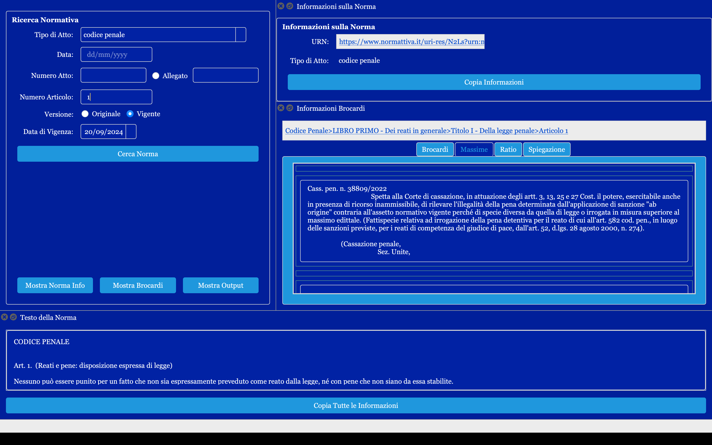

# VisuaLexUI

  

**VisuaLexUI** è un'applicazione GUI (interfaccia grafica) basata su Python e costruita con PyQt6. Permette agli utenti di cercare e visualizzare norme legali, personalizzare i temi dell'interfaccia e gestire le interazioni API per il recupero di dati normativi.

## Indice

- [Caratteristiche](#caratteristiche)
- [Introduzione](#introduzione)
- [Installazione](#installazione)
- [Utilizzo](#utilizzo)
- [Dipendenze](#dipendenze)
- [Contribuire](#contribuire)
- [Licenza](#licenza)
- [Contatti](#contatti)

## Caratteristiche

* **Ricerca Normativa:** Consente di cercare norme legali per tipo di atto, data, numero di articolo e versione (originale o vigente).
* **Temi Personalizzabili:** Personalizza l'aspetto dell'applicazione tramite un dialogo dedicato ai temi.
* **Integrazione API:** Recupera dati da un'API remota (VisuaLexAPI) con gestione degli errori, ripetizioni dei tentativi e caching.
* **Visualizzazione Informazioni Brocardi:** Mostra metadati giuridici dettagliati, incluse informazioni dal sito brocardi.com.



## Introduzione

Per iniziare con **VisuaLexUI**, segui le istruzioni di installazione qui sotto e avvia l'applicazione per esplorarne le funzionalità.

## Installazione

Segui questi passaggi per configurare l'applicazione sulla tua macchina locale:

1. **Clona il Repository:**

   ```bash
   git clone https://github.com/capazme/VisuaLexUI.git
   cd VisuaLexUI
   ```
2. **Crea un Ambiente Virtuale:**

   Assicurati che Python 3.7+ sia installato. Puoi verificare eseguendo il seguente comando:

   ```bash
   python3 --version
   ```

   Poi, crea un ambiente virtuale Python usando `venv`:

   ```bash
   python3 -m venv .venv
   ```

   Attiva l'ambiente virtuale:

   - **Su Linux/macOS:**

   ```bash
   source .venv/bin/activate
   ```

   - **Su Windows:**

   ```bash
   .venv\Scripts\activate
   ```
3. **Installa le Dipendenze:**

   Installa le dipendenze necessarie utilizzando `pip`:

   ```bash
   pip install -r requirements.txt
   ```
4. **Costruisci l'Applicazione:**

   Per costruire l'applicazione, esegui lo script appropriato per il tuo sistema operativo:

   - **Su Windows:**

   ```bash
   build.bat
   ```

   - **Su macOS/Linux:**

   ```bash
   bash build.sh
   ```

   L'applicazione costruita si troverà nella directory specificata.

## Utilizzo

- **Interfaccia di Ricerca:** Usa i campi di input per cercare norme legali in base al tipo di atto, data, numero di atto e numero di articolo.
- **Personalizzazione dei Temi:** Vai su "Impostazioni" > "Personalizza Tema" per regolare il tema dell'applicazione.
- **Gestione dell'URL dell'API:** Modifica l'URL dell'API tramite "Impostazioni" > "Cambia URL API" per impostare un nuovo endpoint per VisuaLexAPI.

## Dipendenze

- **Python 3.7+**
- **PyQt6**
- **Requests**
- **Altre librerie:** Elencate in `requirements.txt`

## Contribuire

I contributi sono benvenuti! Segui questi passaggi per contribuire:

1. **Fai un fork del repository.**
2. **Crea un nuovo branch** per la tua funzionalità (`git checkout -b feature/AmazingFeature`).
3. **Fai commit delle tue modifiche** (`git commit -m 'Aggiunta di una AmazingFeature'`).
4. **Esegui il push sul branch** (`git push origin feature/AmazingFeature`).
5. **Apri una Pull Request.**

## Licenza

Questo progetto è concesso sotto licenza MIT. Puoi utilizzare, modificare e distribuire liberamente questo software. Consulta il file [LICENSE](LICENSE) per maggiori dettagli.

## Contatti

Per ulteriori informazioni, puoi contattare il manutentore del progetto:

- GitHub: [capazme](https://github.com/capazme)
